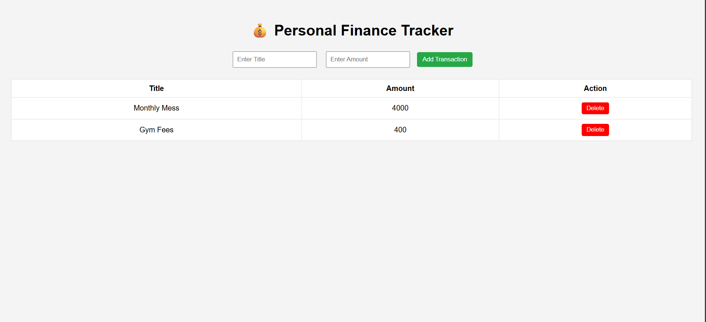
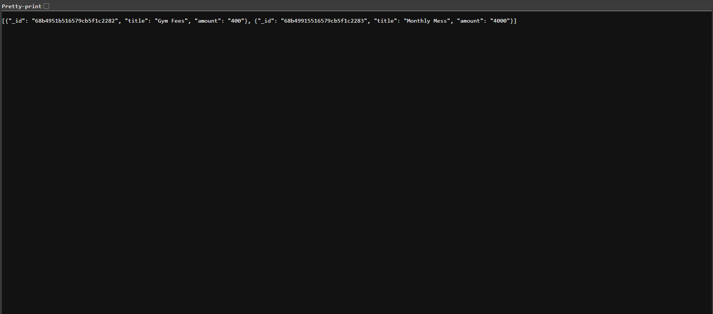

# 💰 Personal Finance Tracker

A simple **Personal Finance Tracker** built with **Django, Django REST Framework, MongoDB, and Vanilla JavaScript**.  
This project allows users to **add, view, and delete transactions** (income/expenses) with a clean frontend interface.

---

## 🚀 Features

- Add new transactions with **title and amount**  
- View all transactions in a table  
- Delete transactions with a single click  
- REST API built using **Django REST Framework**  
- MongoDB used as the database for persistence  
- Frontend built with **HTML, CSS, JavaScript (Fetch API)**  

---

## 🛠️ Tech Stack

- **Backend:** Django, Django REST Framework  
- **Database:** MongoDB (`pymongo`)  
- **Frontend:** HTML, CSS, JavaScript (Vanilla)  
- **Language:** Python 3.12.5  

---

## 📂 Project Structure

```
finance-tracker/
│── finance/ # Django project folder
│ ├── settings.py # Project settings
│ ├── urls.py # Global routes
│
│── transactions/ # Django app
│ ├── views.py # API & frontend views
│ ├── urls.py # API routes
│
│── templates/ # Frontend templates
│ ├── index.html # Main frontend page
│
│── manage.py # Django project runner
│── README.md # Documentation
```


## ⚙️ Installation

### 1️⃣ Clone the Repository
```bash
git clone https://github.com/your-username/finance-tracker.git
cd finance-tracker
```

### 2️⃣ Create & Activate Virtual Environment
```bash
python -m venv venv
venv\Scripts\activate   # For Windows
source venv/bin/activate # For Mac/Linux
```

### 3️⃣ Install Dependencies
```bash
pip install django djangorestframework pymongo
```


### 4️⃣ Setup Django Project
- Run migrations (for Django’s built-in apps):
```bash
python manage.py migrate
```

### 5️⃣ Run the Server
```bash
python manage.py runserver
```

Server will start at:

```cpp
http://127.0.0.1:8000/
```


### 🌐 API Endpoints

| Method | Endpoint | Description |
|--------|-----|-----------|
| GET | `/api/transactions/` | Get all transactions |
| POST | `/api/transactions/add/` | Add a new transaction |
| DELETE | `/api/transactions/delete/<id>/` | Delete a transaction by ID |

<br>

Example Request (POST):
```json
{
  "title": "Grocery Shopping",
  "amount": 500
}
```

## 🎨 Frontend

Frontend is a simple HTML + CSS + JS page (`templates/index.html`) where:
- Users can add transactions
- View transactions in a table
- Delete transactions via Delete button
<br>

## 🖼️ Screenshots

### Home Page


### Adding Transactions

<br>

## 🔮 Future Enhancements
- Edit transaction feature
- Categorize transactions (Income/Expense)
- Monthly expense reports
- User authentication
<br>

## 🤝 Contributing
Pull requests are welcome!<br>
For major changes, please open an issue first to discuss what you would like to change.

## 📜 License
This project is licensed under the MIT License.
<br>

## 👨‍💻 Author
🚀 Learning Full Stack Development with Django + MongoDB<br>
📌 Open to contributions and suggestions
```yaml
👉 Do you want me to also write **step-by-step MongoDB setup instructions** (since you’re using `pymongo` instead of Django ORM)? That way anyone running the project won’t get database errors.
```
